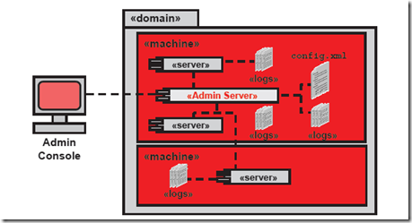

# weblogic介绍

[toc]

## 1. 简介

WebLogic是美国Oracle公司出品的一个application server，确切的说是一个基于JAVAEE架构的中间件，WebLogic是用于开发、集成、部署和管理大型分布式Web应用、网络应用和数据库应用的Java应用服务器。将Java的动态功能和Java Enterprise标准的安全性引入大型网络应用的开发、集成、部署和管理之中。

通俗的讲weblogic是一种web容器，如果你知道apache，tomcat，iis你就应该知道，就是把我们开发的java应用程序运行起来，并提供服务的一种程序。

### 1.1 Domain 

域是作为单元进行管理的一组相关的 WebLogic Server 资源。一个域包含一个或多个 WebLogic Server 实例，这些实例可以是群集实例、非群集实例，或者是群集与非群集实例的组合。一个域可以包含多个群集。域还包含部署在域中的应用程序组件、此域中的这些应用程序组件和服务器实例所需的资源和服务。应用程序和服务器实例使用的资源和服务示例包括计算机定义、可选网络通道、连接器和启动类。

Domain 中包含一个特殊的 WebLogic 服务器实例，叫做 Administration Server，这是我们配置、管理Domain中所有资源的核心。通常，我们称加入Domain中的其他实例为 Managed Server，所有的Web应用、EJB、Web Services和其他资源都部署在这些服务器上。

我们可以按照以下的一些标准来组织Domain：程序的逻辑划分，例如一个电商网站，可以将前台作为一个Domain，订单处理作为一个Domain，其他资源作为一个Domain；以物理地域为划分，例如一个跨国公司的网站，每个国家可以建立一个Domain；以尺寸来划分。

### 1.2 Managed Server 

被管理服务器是一个WebLogic Server的实例，他从Admin Server那里获取配置信息。通常在Managed Server上部署自己的服务、组件或应用。基于性能考虑，Managed Server维护着一份只读的域配置文件，当服务启动的时候，会从Admin Server上同步配置文件信息，如果配置文件发生了改变，Admin Server也会将改变推送到Managed Server上。

### 1.3 Machine 

Machine 是指运行WebLogic Server实例的物理机器，通常与部属在其上的Managed Server相关连。Machine用于Node Manager（一个运行在物理服务器上的进程，可以远程重启Admin 和 Managed Server）重启失败的Managed Server，以及为集群的Managed Servers选择合适的Session存放位置（Session避免存放在同一台Machine上）。

## 2. 基础操作

### 2.1 weblogic安装

weblogic安装部署文档请参考

[04呼叫中心-weblogic安装部署](./04呼叫中心-weblogic安装部署.docx)

### 2.2 Nginx安装（负载均衡）

Nginx安装部署以及配置文档请参考

[06nginx安装部署+Nginx配置.docx](./06nginx安装部署+Nginx配置.docx)

### 2.3 weblogic发布服务

1: 登录weblogic后，初始页面内容中点击左侧的部署，如图：

2: 点击安装，根据操作点击下一步 上传自己服务的war包注意：weblogic和Tomcat部署服务有区别，Tomcat会解压war包，weblogic不会解压war，所以上传war时候需要把对应环境的配置都调整好 选择服务所在的server,其他都默认下一步直接到完成，如图：

这里发布服务base不用选择，因为base服务状态是shutdown，只有adminserver是running状态

### 2.4 服务基于weblogic集群

暂无

### 2.5 发布服务测试(单机+负载均衡)

#### 2.5.1 weblogic直连测试--单机

#### 2.5.2 weblogic+Nginx测试--负载均衡

总结：以上2种测试效果其实是一样，只是从部署结构上一个是单机（单节点）直连一个是负载均衡（多节点）

### 2.6 weblogic集群测试

暂无

## 3. 基础配置

### 3.1 weblogic系统配置

系统配置只需要在对应的Server上配置，不需要重新配置，如果创建新的Server就需要重新配置

1：端架左侧菜单环境-》服务器，进入页面后点击我们发布的服务AdminServer(管理)

2：进入到AdminServer的配置下，选择头部的“超载”菜单，下面有一个最大线程阻塞时间建议1200（默认是600）可以根据实际调整

3：选择头部“并发”菜单，最大并发新建线程数建议300（默认100）   最大并发长时间请求数100（默认100），可以根据实际调整

4：点击“服务器启动”菜单 ，在下面的参数设置如下内容

空间大小配置内容：

~~~
-Xms2048m  -Xmx2048m  -XX:PermSize=512m -XX:MaxPermSize=1024m
~~~

配置说明：

~~~
-Xmx    Java Heap最大值，默认值为物理内存的1/4，最佳设值视物理内存大小及计算机内其他内存开销而定

-Xms    Java Heap初始值，Server端JVM最好将-Xms和-Xmx设为相同值，开发测试机JVM可以保留默认值；
-XX:MaxPermSize     Perm（俗称方法区）占整个堆内存的最大值
~~~

日志级别，线程大小配置

~~~
-Xms2048m -Xmx4096m -XX:PermSize=256m -XX:MaxPermSize=512m -XX:+UseConcMarkSweepGC -XX:+CMSClassUnloadingEnabled -XX:+DisableExplicitGC -XX:-HeapDumpOnOutOfMemoryError -Dweblogic.threadpool.MinPoolSize=50 -Dweblogic.threadpool.MaxPoolSize=150 -Dfile.encoding=UTF8 -Dlog4jLevel=debug -Djava.awt.headless=true
~~~

日志级别说明

~~~
 DEBUG：指出细粒度信息事件对调试应用程序是非常有帮助的，主要用于开发过程中打印一些运行信息。
    
 INFO：消息在粗粒度级别上突出强调应用程序的运行过程。打印一些你感兴趣的或者重要的信息，这个可以用于生产环境中输出程序运行的一些重要信息，但是不能滥用，避免打印过多的日志。
    
 WARN：表明会出现潜在错误的情形，有些信息不是错误信息，但是也要给程序员的一些提示。
    
 ERROR：指出虽然发生错误事件，但仍然不影响系统的继续运行。打印错误和异常信息，如果不想输出太多的日志，可以使用这个级别。
    
 FATAL：指出每个严重的错误事件将会导致应用程序的退出。这个级别比较高了。重大错误，这种级别你可以直接停止程序了。
~~~

日志详细介绍

**服务器日志** 每个 WebLogic Server 实例将来自子系统和应用程序的所有消息写入位于本地主机上的服务器日志文件。默认情况下，服务器日志文件位于服务器实例根目录下的 logs 目录中；例如，DOMAIN_NAME\servers\SERVER_NAME\logs\SERVER_NAME.log，其中 DOMAIN_NAME 是在其中定位域的目录的名称，而 SERVER_NAME 是服务器的名称。

可在管理控制台的Gernal属性页中设置该文件的路径及名字，错误的输出的等级等。 每条日志消息都具有关联的严重程度级别。日志消息的级别大致说明其重要级别或紧急级别。WebLogic Server 具有从 TRACE 到 EMERGENCY 的预定义严重程度，在将日志请求调度给记录器时，会将对应严重程度转换为日志级别。日志级别有如下取值  可以在记录器和处理程序上设置日志严重程度级别。在记录器上进行设置时，任何处理程序都不会收到记录器已拒绝的事件。例如，如果在记录器上将日志级别设置为 NOTICE，则任何处理程序都不会收到 INFO 级别的事件。在处理程序上设置日志级别时，仅会对处理程序应用限制，而不会对其他程序应用限制。例如，为文件处理程序关闭 DEBUG 意味着不会将任何 DEBUG 消息写入日志文件，但会将 DEBUG 消息将写入标准输出。

**DOMAIN日志** 除将消息写入服务器日志文件外，每个服务器实例还会将其一部分消息转发到域范围日志文件。默认情况下，服务器仅转发严重程度级别为 NOTICE 或更高的消息。虽然可以对转发哪些消息进行修改，但服务器永远不转发严重程度级别为 DEBUG 的消息。 域日志文件提供用于查看域整体状态的中央位置。域日志驻留在管理服务器的 logs 目录中。域日志文件的默认名称和位置是 DOMAIN_NAME\servers\ADMIN_SERVER_NAME\logs\DOMAIN_NAME.log，其中，DOMAIN_NAME 是在其中定位域的目录的名称，而 ADMIN_SERVER_NAME 是管理服务器的名称。 域日志中记录的时间戳是发出消息的服务器的时间戳。域日志中的日志记录不会按照其时间戳顺序写入；会在消息到达后立即将其写入。有可能受管服务器在一段时间内无法与管理服务器联系。在这种情况下，消息被缓冲在本地并在重新连接服务器之后发送到管理服务器。

**HTTP访问日志** 在WebLogic中可以对用HTTP，HTTPS协议访问的服务器上的文件都做记录，该LOG文件默认的名字为Access.log,内容如下，该文件具体记录在某个时间，某个IP地址的客户端访问了服务器上的那个文件。 127.0.0.1 - - [25/Feb/2002:11:35:58 +0800] "GET /weather HTTP/1.1" 302 0 127.0.0.1 - - [25/Feb/2002:11:35:58 +0800] "GET /weather/index.Html HTTP/1.1" 200 176 HTTP访问日志的属性可在HTTP属性页中进行设置。

HTTP 子系统在文本文件中保留所有 HTTP 事务的日志。HTTP 访问日志的默认位置和滚动策略与服务器日志相同。可以为每个服务器或每个定义的虚拟主机设置用于定义 HTTP 访问日志行为的特性。

**服务器实例如何将消息转发到域日志** 为将消息转发到域日志，每个服务器实例会广播其日志消息。服务器会广播除严重程度级别为DEBUG 的消息以外的所有消息和消息文本。 管理服务器会监听以上消息中的一部分消息，并将它们写入域日志文件。为监听这些消息，管理服务器在每台受管服务器中注册监听器。默认情况下，该监听器包含一个筛选器，仅允许将严重程度级别为 NOTICE 和更高级别的消息转发到管理服务器。具体机制参见下图

 对于任何给定WebLogic Server 实例，可以覆盖默认筛选器并创建一个日志筛选器，从而将一组不同的消息集写入域日志文件。如果管理服务器不可用，则受管服务器继续将消息写入其本地的服务器日志文件。但在默认情况下，当重新连接到服务器时，并不会将断开连接期间写入的所有消息转发到域日志文件。受管服务器在缓冲区中保留指定数量的消息，从而在重新连接到服务器时可以将它们转发到管理服务器。在缓冲区中保留的消息数量由 LogMBean 上的 DomainLogBroadcasterBufferSize 特性配置。默认值为 1。如配置为使用默认值，则在重新连接管理服务器后，仅将最后记录的消息转发到该服务器。例如，如果管理服务器在两小时不可用之后恢复，则域日志中不包含这两小时内生成的任何消息。如果已配置大于 1 的值，则在受管服务器重新连接到管理服务器之后，会将对应数量的消息转发到域日志。 注意：这会导致在域日志文件中，具有较早时间戳的消息列在具有较晚时间戳的消息之后。当之前断开连接的受管服务器的缓冲区中消息刷新到管理服务器之后，即使这些消息是在域日志中原有消息之前生成的，它们也会直接追加到域日志中。 **日志消息格式** 在 WebLogic Server 实例向服务器日志文件中写入消息时，每条消息的第一行以 #### 开头，后跟该消息的特性。每个特性都括在尖括号中。 以下是服务器日志文件中一条消息的示例： ####<Sept 22, 2004 10:46:51 AM EST> <Notice> <WebLogicServer> <MyComputer> <examplesServer> <main> <<WLS Kernel>> <> <null> <1080575211904> <BEA-000360> <Server started in RUNNING mode> 在此示例中，消息的特性为：按区域设置格式的时间戳、严重程度、子系统、计算机名、服务器名、线程 ID、用户 ID、事务 ID、诊断上下文 ID、原始时间值、消息 ID 和消息文本。（后面的消息特性部分中描述各个特性。） 如果一条消息不是在事务上下文中记录的，则即使不包含事务 ID，也会包含用于事务 ID 的尖括号。 如果该消息中包含一个堆栈跟踪，则该堆栈跟踪包含在消息文本中。WebLogic Server 为其写入的消息使用主机的默认字符编码。 **标准输出和标准错误中输出的格式** 在 WebLogic Server 实例将一条消息写入标准输出时，该输出不包含 #### 前缀，也不包含服务器名、计算机名、线程 ID、用户 ID、事务 ID、诊断上下文 ID 和原始时间值字段。 以下示例说明如何将前一部分中的消息输出到标准输出中： <Sept 22, 2004 10:51:10 AM EST> <Notice> <WebLogicServer> <BEA-000360> <Server started in RUNNING mode> 在此示例中，消息特性为：按区域设置格式的时间戳、严重程度、子系统、消息 ID 和消息文本。 **图形界面操作** 登录weblogic后台进行相关操作 1.日志相关参数设置 左侧菜单:环境–>服务器 右侧菜单:服务器–>日志记录 只找到AdminServer.log、access.log，进行一些操作 如:设置日志文件的回滚,设置日志文件名等 2.日志查看 左侧菜单:环境–>服务器 右侧菜单:点击服务器名称 左侧菜单:诊断–>日志文件 右侧菜单:选中相关日志点击查看

5: 点击proddomain-》配置-》并发 

参数默认值都是50

### 3.2 发布服务配置

发布服务的配置是每次发布服务后都需要重新配置一次

1：回到初始页面可以看到发布好的服务（如果不知道可以点击左侧的部署菜单）

2：选中发布的服务进入到如图界面

3：点击配置进入配置内容，这里主要是调整2个参数 最大内存中会话数（默认是1） JSP页面检查（默认是1）都调整成-1 可以查看后面框定的注释说明-1是不进行任何检查不占用资源

### 3.3 查看配置所在文件位置

## 4. 通用命令

1：启动weblogic命令

cd /usr/local/weblogic/weblogic/user_projects/proddomain/bin

nohup ./startWebLogic.sh

2：查看weblogic进程

ps -ef|grep weblogic

3：查看服务器weblogic资源使用

top  查看服务器进程情况

4：停止weblogic命令

cd /usr/local/weblogic/weblogic/user_projects/proddomain/bin

./stopWebLogic.sh

5：日志查看

cd /usr/local/weblogic/weblogic/user_projects/proddomain/logs

## 5. 已知问题和遇到的坑

### 5.1 服务部署失败

部署服务时候回出现服务发布不成功，重启weblogic服务后恢复

### 5.2 weblogic初步访问很慢

目前这个是已知问题Java JVM和Linux环境匹配时候（ 实际是JVM在Linux下的bug：他想调用一个随机函数，但是取不到。）

~~~
1)较好的解决办法：
        在Weblogic启动参数里添加 “-D java.security.egd=file:/dev/./urandom” (/dev/urandom 无法启动)
2)最差的解决办法： 
        执行命令 mv /dev/random /dev/random.ORIG ; ln /dev/urandom /dev/random
　　将/dev/random 指向/dev/urandom
3)最好的解决办法：
        修改Linux上Weblogic使用的jdk $JAVA_HOME/jre/lib/security/java.security 文件
　　将securerandom.source=file:/dev/random 修改为 securerandom.source=file:/dev/./urandom

这样可以解决任何一个域Weblogic启动慢的问题的问题
~~~

总结：演示环境做了测试目前发现没有多大的效果

### 5.3 weblogic发布服务中集成OData

1：OData中使用的协议

2：现有系统组件包使用的协议情况

使用以上的odata组件后weblogic，Tomcat，java -jar都有odata访问异常问题

